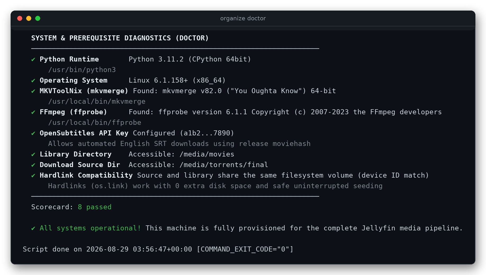
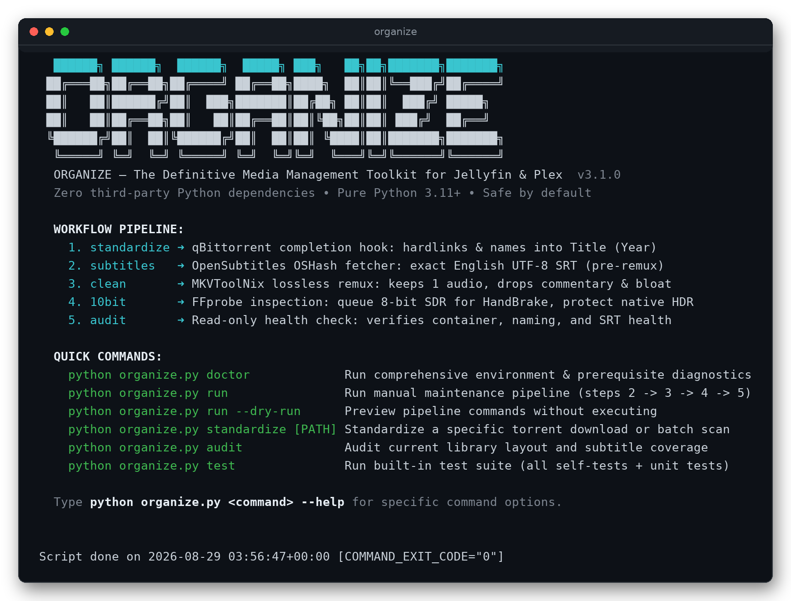
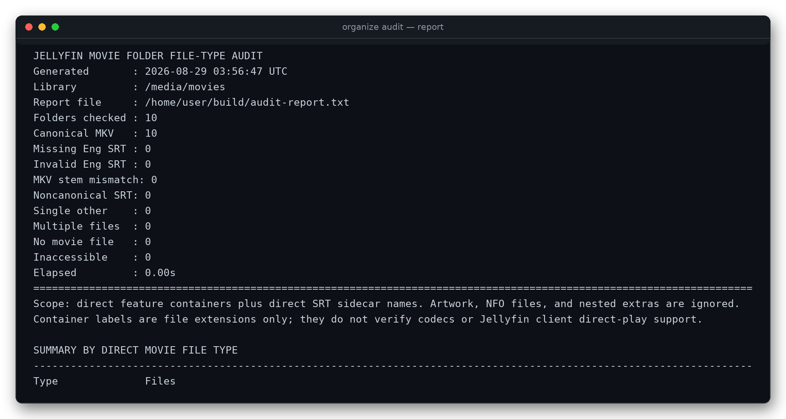

<div align="center">


**A rock-solid, dependency-free pipeline that turns finished torrents into a
perfectly organized, 100% Direct Play Jellyfin &amp; Plex movie library —
with zero duplicate disk usage, exact-match subtitles, and lossless track
cleanup.**

[](https://github.com/smeltzzz/organize/actions/workflows/ci.yml)
[](https://www.python.org/)
[-2EA44F.svg?style=flat-square)](requirements.txt)
[-2EA44F.svg?style=flat-square)](run_tests.sh)
[](https://jellyfin.org/)
[](docs/)
[](LICENSE)

[Quickstart](#-quickstart-in-90-seconds) •
[The Pipeline](#-the-pipeline) •
[The Five Tools](#-the-five-tools) •
[Reading the Reports](#-reading-the-reports) •
[Why It's Different](#-why-its-different) •
[Safety Invariants](#-core-safety-invariants) •
[Documentation](#-documentation)

</div>

---

## 🧭 What is Organize?

**Organize** is a suite of five purpose-built Python tools plus one unified
CLI that ingest completed torrent downloads and maintain a canonical
**Jellyfin / Plex movie library**:

```
Title (Year)/
├── Title (Year).mkv        ← one losslessly-cleaned MKV per movie
└── Title (Year).eng.srt     ← one validated English subtitle (hash-matched when available)
```

Unlike bloated container stacks with hundred-megabyte images, SQLite lockups,
and fragile web UIs, Organize is **100% standard-library Python 3.11+**:

| | |
| :--- | :--- |
| 🫧 **Zero pip installs** | The whole toolkit *is* the checkout. No venv, no Docker required. |
| 🔗 **Hardlink-only ingest** | Organized movies share disk sectors with your seeds — **0 extra bytes**, seeding never interrupted. |
| 💬 **Exact-match subtitles** | OpenSubtitles moviehash matching while container bytes are still pristine, then SubDL's release-aware filename match (only score ≥ 0.80) with a strict title/year fallback when no filename candidate exists. |
| ✂ **Lossless track cleanup** | `mkvmerge` remux keeps the single best English audio track (or best non-commentary audio on foreign films with a validated `.eng.srt`) and drops commentary, dubs, and embedded bitmap subtitles — video untouched. |
| 🎨 **Bit-depth intelligence** | A fail-closed inspector queues 8-bit SDR for HandBrake while strictly protecting native HDR10 / HDR10+ / Dolby Vision. |
| 🩺 **Read-only health checks** | A 100% read-only auditor validates layout and subtitle integrity with scheduler-friendly exit codes. |
| 🛡 **Safety invariants** | Advisory locks, atomic staging, transaction journals, and crash recovery — engineered so a power cut can never corrupt your library. |

<div align="center">
  <a href="#-quickstart-in-90-seconds"><em>See it run — the doctor verifies your whole setup in one command ↓</em></a>
</div>

---

## 🚀 Quickstart in 90 seconds

### 1 · Check your machine with `doctor`

```bash
git clone https://github.com/smeltzzz/organize.git
cd organize
python3 organize.py doctor            # Windows: py organize.py doctor
```



`doctor` verifies Python, `mkvmerge` (MKVToolNix), `ffprobe` (FFmpeg), your
OpenSubtitles and/or SubDL provider key, and — crucially — that your download
folder and library sit on the **same filesystem volume** so hardlinks work.
Missing pieces are reported with the exact fix, never a crash.

### 2 · Wire up qBittorrent ingest

In qBittorrent → **Options → Downloads → Run external program on torrent
completion**, enter:

```cmd
:: Windows (cmd / PowerShell)
py "C:\Tools\organize\organize.py" standardize "%F"

# Linux / macOS (bash)
/opt/organize/organize.sh standardize "%F"
```

> [!IMPORTANT]
> In qBittorrent → **Options → BitTorrent → Seeding Limits**, set *"When ratio
> reaches"* / *"When seeding time reaches"* to **Remove torrent and its content**.
> The organized movie is a hardlink, so deleting the download entry leaves your
> library file 100% intact while dropping the link count — which is exactly what
> unblocks the track cleaner on its next sweep.

### 3 · Run the maintenance pipeline

```bash
python3 organize.py run --dry-run     # preview every command first
python3 organize.py run               # subtitles -> remux -> 10-bit -> audit
python3 organize.py run --nice        # low priority: Jellyfin streaming is never starved
```

Then point Jellyfin at your organized folder as a **Movies** library. Done —
every movie is canonically named, subtitle-complete, and direct-play safe.

> [!TIP]
> Set `OPENSUBTITLES_API_KEY` for the preferred exact-release moviehash source,
> and optionally set `SUBDL_API_KEY` for [SubDL's documented release-aware
> filename matching](https://subdl.com/developers). Automatic SubDL picks require
> `match_score ≥ 0.80`; it can also run alone, but has no byte-identical moviehash
> match. Full reference:
> [docs/CONFIGURATION_REFERENCE.md](docs/CONFIGURATION_REFERENCE.md).

---

## 🔄 The pipeline

Five tools, one fixed order. The order between **subtitles** and **remux** is
load-bearing — a remux rewrites the container bytes that OpenSubtitles hashes,
so fetching subtitles *after* cleaning permanently destroys the exact-match
search. `pipeline.py` exists so you cannot get this wrong.

```
 torrent finishes
        │
        ▼
┌───────────────────────┐   hardlink into Title (Year)/Title (Year).mkv
│ 1 · standardize       │   parse scene names, skip TV / discs / splits
└───────────┬───────────┘
            ▼
┌───────────────────────┐   exact OSHash match (moviehash_match=only),
│ 2 · subtitles         │   OpenSubtitles hash first, score-gated SubDL release fallback, UTF-8 .eng.srt
└───────────┬───────────┘
            ▼
┌───────────────────────┐   lossless mkvmerge remux: 1 best English audio
│ 3 · clean             │   (or best non-commentary audio + .eng.srt on foreign films)
└───────────┬───────────┘
            ▼
┌───────────────────────┐   ffprobe sweep: QUEUE 8-bit SDR, KEEP native HDR,
│ 4 · 10bit             │   REVIEW ambiguous metadata — never guess
└───────────┬───────────┘
            ▼
┌───────────────────────┐   100% read-only layout + subtitle health check
│ 5 · audit             │   gating exit codes for cron / Task Scheduler
└───────────────────────┘
```

`1 · standardize` fires automatically from the qBittorrent hook; `run`
executes steps 2 → 5 in order. Every step skips cleanly (with the reason
printed) when its prerequisite is missing.

<div align="center">
  
</div>

---

## 🧰 The five tools

| Tool | What it does | Needs | Artifacts (always outside the library) |
| :--- | :--- | :--- | :--- |
| **[`movie_standardizer.py`](movie_standardizer.py)** | qBittorrent hook: parses scene/release names into canonical `Title (Year)`, hardlinks into the library (zero duplicate space), skips TV, discs, multipart splits, non-MKV. Existing movies are only replaced after an ffprobe-verified same-cut *technical upgrade* — never on size alone. | *Nothing* (ffprobe optional, for upgrade checks) | `movie_standardizer.log` · `movie_standardizer_report.txt` |
| **[`subtitle_fetcher.py`](subtitle_fetcher.py)** | Fetches one validated human-authored English UTF-8 SRT per movie. Exact OpenSubtitles **moviehash** first (`moviehash_match=only` — byte-identical release match), then optional SubDL `/files/search` release matching (`match_score ≥ 0.80`). If that route finds no usable candidate, one strict title/year SubDL query is allowed. SubDL can run alone; ambiguous/low-score candidates remain review-only. Durable per-provider quota reservations prevent waste. | `OPENSUBTITLES_API_KEY` *(recommended)* and/or `SUBDL_API_KEY` | `subtitle_fetcher.log` (also the quota ledger) · `subtitle_fetcher_report.txt` |
| **[`mkv_track_cleaner.py`](mkv_track_cleaner.py)** | Lossless `mkvmerge` remux: keeps the single highest-quality English audio track (or the best non-commentary audio on foreign films that already have a validated `.eng.srt`), purges commentary / descriptive-audio / extra dubs, strips embedded subtitles once that sidecar exists. Transaction-journaled, fingerprint-verified, atomic. | `mkvmerge` *(MKVToolNix)* | `mkv_track_cleaner.log` · `mkv_track_cleaner_report.txt` · probe cache |
| **[`10bit.py`](10bit.py)** | ffprobe inspection that classifies every movie: **QUEUE** (8-bit SDR → re-encode to 10-bit HEVC/AV1), **SKIP** (already high bit-depth), **KEEP** (native HDR — protected from tone-mapping), **REVIEW** (ambiguous — never auto-queued). Probe cache makes re-sweeps near-instant. | `ffprobe` *(FFmpeg)* | `10bit.log` · `10bit_report.txt` · probe cache |
| **[`library_auditor.py`](library_auditor.py)** | 100% read-only health check: canonical folder/MKV structure, sidecar syntax validation (catches empty, truncated, and HTML-error-page SRTs), remux-aware (no false alarms mid-cleanup). `--fail-on-defects` / `--fail-on-findings` gate scheduled tasks. | *Nothing* (stdlib only) | `library_auditor.log` · `library_auditor_report.txt` |



<details>
<summary><b>🔍 Deep dive · <code>movie_standardizer.py</code> — ingestion &amp; hardlink placement</b></summary>

- **qBittorrent hook** — triggered on torrent completion via `"%F"`; also accepts the older `"%D" "%N"` form, and batch-scans the source folder when run with no arguments.
- **Canonical naming** — release tags, codec tokens, edition labels, and site prefixes are stripped into standard `Title (Year)/Title (Year).mkv`. Roman numerals, stylized titles (*Se7en*, *WALL·E*, *Mix*), and doctor-style abbreviations survive intact.
- **Zero-space hardlinks** — `os.link()` places the file into the library referencing the exact same inode. The torrent keeps seeding; disk usage grows by 0 bytes. There is deliberately **no copy/move fallback**: cross-volume setups are rejected with a clear error instead.
- **Quality-aware upgrades** — if the movie already exists, file size alone never triggers replacement. ffprobe must confirm the same cut (runtime within 30 s or 1%) and a weighted technical score (resolution, HDR, bit depth, channels, codec) must improve meaningfully.
- **Leftover reporting** — non-MKV files, multipart splits, disc structures, and undersized releases are declined and listed under `ITEMS LEFT IN SOURCE` in the report, each with its reason. Nothing is silently lost or deleted.

```bash
python organize.py standardize              # batch scan
python organize.py standardize --dry-run    # preview placements
python movie_standardizer.py "D:\torrents\final\Some.Movie.2023.1080p"   # one folder
```
</details>

<details>
<summary><b>🔍 Deep dive · <code>subtitle_fetcher.py</code> — OSHash matching &amp; quota ledger</b></summary>

- **Why it runs before the remux** — the OpenSubtitles moviehash is the file size plus the sum of the first and last 64 KiB. Submitting it with `moviehash_match=only` returns subtitles uploaded against that *exact release*, guaranteeing sync. A remux rewrites those bytes permanently, demoting the movie to the far weaker title/year search.
- **Strict candidate policy** — only normal (non-SDH, non-forced, non-machine-translated) human English SRTs; trusted flags and ratings outrank raw download counts for a deterministic pick.
- **Conservative provider fallback** — after a hash miss, OpenSubtitles gets a strict title/year check. Optional SubDL then sends only the release basename to its documented `/api/v2/files/search` route, requires its `match` metadata to confirm the canonical movie, and auto-selects only normal English candidates with `match_score ≥ 0.80`. It makes one strict title/year query only when filename matching returns no usable candidate; low-score, ambiguous, and edition-labelled releases (*extended*, *director's cut*, …) are held for review. SubDL is never used ahead of a live OpenSubtitles hash match.
- **Durable per-provider quota ledger** — the append-only log keeps independent local UTC reservations for OpenSubtitles downloads and SubDL's documented free-tier allowances: 2,000 searches and 50 downloads per day. Each SubDL search attempt (including a retry) and each download is reserved *before* it is sent, so an interrupted run never silently exceeds its configured guard.
- **Sidecar safety** — downloads are size-capped, HTTPS-host-validated, archive/gzip-aware, cue-validated, snapshot-checked, and activated via an atomic create-only link so a concurrent sidecar is never overwritten.

```bash
python organize.py subtitles --dry-run      # preview candidates
python organize.py subtitles                # live fetch
python organize.py subtitles --retry-review # reconsider held-for-review movies
```
</details>

<details>
<summary><b>🔍 Deep dive · <code>mkv_track_cleaner.py</code> — lossless remux &amp; seeding deferral</b></summary>

- **Seeding protection** — any file with a hardlink count > 1 (`st_nlink`) is *unconditionally deferred*; there is no override flag. qBittorrent's default seed-limit action only pauses the torrent, so configure it to remove the content — then the deferral clears automatically.
- **Free-space preflight** — a remux cannot rewrite a container in place, so the cleaner demands `size × 1.02 + 64 MiB` free before starting and refuses otherwise, leaving the original untouched.
- **Pre/post-flight fingerprints** — video duration, frame counts, audio/subtitle tracks, chapters, and attachments are fingerprinted before and after. Any mismatch aborts the swap, and a JSON diagnostic is logged.
- **Transaction journals** — every remux stages as a uniquely-named sibling with a `.track_cleaner.<token>.json` journal. Interrupted runs are recovered — or safely flagged for manual review — on the next sweep.
- **SDH-safe classification** — hearing-impaired and text-description *subtitles* are always kept when embedded subs are needed; commentary, isolated scores, and descriptive *audio* are always dropped.

```bash
python organize.py clean --dry-run          # preview remux operations
python organize.py clean --limit 1          # remux exactly one test movie
python mkv_track_cleaner.py --only "/path/Movie (2020)/Movie (2020).mkv"
```
</details>

<details>
<summary><b>🔍 Deep dive · <code>10bit.py</code> — fail-closed bit-depth &amp; HDR inspection</b></summary>

- **Action queues** — `QUEUE FOR HANDBRAKE` (confirmed 8-bit SDR), `SKIP` (already 10/12/16-bit SDR), `KEEP` (HDR10 / HDR10+ / Dolby Vision / HLG — a default HandBrake preset would tone-map or strip dynamic metadata), `REVIEW` (8-bit-tagged HDR or unknown depth — never auto-queued).
- **Fail-closed by design** — BT.2020 primaries alone are *wide gamut*, not HDR; 8-bit + PQ is *not* an SDR candidate; unknown bit depth is never assumed to be 8-bit.
- **Probe cache** — ffprobe JSON is cached per `(path, size, mtime)`; only raw probe output is cached, never a verdict, so a library sweep of 2,000 unchanged movies drops from minutes to well under a second.
- **Scheduler gates** — `--fail-if-queue`, `--fail-if-review`, and `--fail-if-error` map findings to exit codes for automation.

```bash
python organize.py 10bit --dry-run          # list what would be probed
python organize.py 10bit                    # full classification sweep
python organize.py 10bit --fail-if-queue    # exit 3 if 8-bit SDR awaits encoding
```
</details>

<details>
<summary><b>🔍 Deep dive · <code>library_auditor.py</code> — read-only health check &amp; gates</b></summary>

- **Structure** — every top-level folder must hold exactly one canonical MKV whose stem matches the folder name; extra containers, stem mismatches, and missing movies are defects.
- **Sidecar integrity** — `.eng.srt` files are content-validated: empty files, truncated downloads, and provider error pages (HTML 429s) are flagged as `INVALID_SIDECAR` with a fix hint. A missing sidecar is only a *finding* — a freshly standardized movie legitimately has none yet.
- **Remux awareness** — in-flight cleaner staging files (`temp_clean_*`) are ignored, so an audit mid-maintenance never raises false alarms.
- **Scheduler gates** — `--fail-on-defects` exits 1 on layout defects; `--fail-on-findings` also fails on missing subtitles. Default stays 0 so report-only automation keeps working.

```bash
python organize.py audit                    # read-only audit
python organize.py audit --fail-on-defects  # gate a scheduled task
```
</details>

---

## 📄 Reading the reports

Every tool writes exactly one replaceable plain-text report (and one append-only
log) outside your library, and every one of them is drawn by the same shared
renderer in `common.py`, so they all read the same way:

```
┌ 1  boxed header        what ran, where, with which settings
├ 2  scorecard           right-aligned counts, one line per outcome
├ 3  "Start here:"       the single cheapest thing to do next
├ 4  action sections     grouped by the fix, cheapest first, every item named
└ 5  inventory           the complete list, so nothing is hidden by a summary
```

`subtitle_fetcher.py` is the clearest example. Its report answers the only two
questions that matter — *what still needs a subtitle*, and *what already has
one*:

```
  ──────────────────────────────────────────────────────────────────────────────
    18   Already have .eng.srt   validated sidecar beside the movie
     1   Downloaded this run     written as <movie>.eng.srt
     3   NEED A SUBTITLE         action required · every one is listed below
    22   Movies in the library   every folder holding an eligible MKV
  ──────────────────────────────────────────────────────────────────────────────
  Start here: 1 movie(s) in "SIDECAR EXISTS BUT IS UNUSABLE" · delete the file, then re-run.

  ══ MOVIES THAT NEED A SUBTITLE ══════════════════════════════════════ 3 of 22 ══

  ── SIDECAR EXISTS BUT IS UNUSABLE ────────────────────────────────────────── 1 ──
  Delete the named file, then re-run this tool. Nothing replaces a sidecar it
  believes is already present, so a corrupt file blocks a good download forever.

       1  Broken (2009)
            'Broken (2009).eng.srt' exists but is unusable (empty, truncated, or not an SRT)

  ── DEFERRED TO THE NEXT UTC DAY ──────────────────────────────────────────── 2 ──
       1  Zodiac (2007)
            never scanned: the UTC request cap was reached before this movie

  ══ MOVIES THAT ALREADY HAVE AN EXTERNAL .eng.srt ══════════════════════════ 18 of 22 ══

       1  Alita Battle Angel (2019)                 Alita Battle Angel (2019).eng.srt
       2  Dune (2021)                               Dune (2021).eng.srt
```

The other reports follow the same shape: `library_auditor.py` opens with *folders
that need attention*, `10bit.py` with the *HandBrake queue*, `mkv_track_cleaner.py`
with *what needs a decision* (errors, movies remuxed without a validated `.eng.srt`,
hardlink deferrals), and `movie_standardizer.py` with `ITEMS LEFT IN SOURCE` — the
one section where doing nothing quietly leaves files in your torrent folder forever.

---

## 💎 Why it's different

Most media automation stacks pull in containers, databases, and web UIs to
solve problems this pipeline solves with five focused scripts — and several
of these guarantees are structurally impossible in a copy-based workflow:

| Guarantee | How Organize delivers it |
| :--- | :--- |
| **Zero duplicate disk usage while seeding** | Hardlink-only ingest. A 60 GB remux joins your library as a second *name*, not a second *file*. |
| **Subtitles that are actually in sync** | Moviehash matching against the untouched release bytes — verified before any remux can invalidate the hash. |
| **100% Direct Play, no transcode traps** | External UTF-8 SRT sidecars only; embedded PGS/VobSub bitmap subs are stripped after the sidecar is verified. |
| **No accidental HDR destruction** | The bit-depth inspector fail-closes: native HDR is *kept*, ambiguous metadata goes to a human review queue. |
| **Crash-safe by construction** | Atomic `os.replace` staging everywhere, transaction-journaled remuxes with orphan recovery, fail-closed advisory locks. |
| **Auditable** | Every run leaves a plain-text report and an append-only log outside the library, and every report uses the same layout: counts first, then what needs a decision, then the full inventory. |
| **Runs anywhere Python 3.11 runs** | Stdlib only — Windows, Linux, macOS, Docker, Unraid, TrueNAS. No venv ceremony, no dependency drift, no CVE surface. |

Organize complements rather than replaces acquisition tooling: Radarr/qBittorrent
decide *what* lands in your download folder; Organize turns it into a library
Jellyfin can serve bit-for-bit.

### 🎯 The Jellyfin Direct Play philosophy

Why do media servers transcode in the first place?

1. **The subtitle transcode trap** — bitmap subtitles (PGS, VobSub) and complex
   ASS styles can't be rendered by browsers, sticks, and smart TVs, so Jellyfin
   burns them into the video in real time: 80–100% CPU/GPU. *The fix:* a plain
   external UTF-8 `.eng.srt` is rendered by the client natively — **0% server cost**.
2. **Audio track bloat** — commentary, descriptive audio, and redundant 7.1
   dubs freeze weak client decoders. *The fix:* one best English track, losslessly kept.
3. **8-bit banding vs. 10-bit color** — 8-bit SDR posterizes shadows and skies.
   *The fix:* queue it for a 10-bit HEVC/AV1 re-encode — while never
   tone-mapping native HDR by mistake.

Full technical breakdown: [docs/JELLYFIN_DIRECT_PLAY.md](docs/JELLYFIN_DIRECT_PLAY.md).

---

## 💻 The unified CLI

```bash
python organize.py <command> [options]     # Windows: py organize.py <command>
```

| Command | Alias | What it does |
| :--- | :--- | :--- |
| `doctor` | `check` | Verifies Python, `mkvmerge`, `ffprobe`, API key, paths, and hardlink compatibility — with per-check fixes |
| `run` | `pipeline` | Runs the maintenance pipeline in the correct, moviehash-safe order |
| `standardize` | `std` | Rename & hardlink completed torrents into `Title (Year)/Title (Year).mkv` |
| `subtitles` | `subs` | Fetch validated English UTF-8 SRT sidecars: OpenSubtitles hash-first, SubDL fallback |
| `clean` | `remux` | Lossless remux: keep one best English audio (or best non-commentary audio on foreign films with `.eng.srt`), strip embeds/bloat |
| `10bit` | `probe` | ffprobe 8-bit vs 10-bit & native-HDR compliance sweep |
| `audit` | — | Read-only health check of layout, naming, and subtitle sidecars |
| `test` | `tests` | Run all self-tests (add `--unit` for the 274-test unit suite) |

Launchers wrap it for every platform — `organize.sh` (bash), `organize.ps1`
(PowerShell), `organize.bat` (cmd) — and each underlying script still runs
standalone with the exact same flags. Complete flag/defaults/env reference:
[docs/CONFIGURATION_REFERENCE.md](docs/CONFIGURATION_REFERENCE.md).

---

## 🔒 Core safety invariants

Non-negotiable rules every tool obeys — see
[docs/ARCHITECTURE_SAFETY.md](docs/ARCHITECTURE_SAFETY.md) for the full design
analysis.

1. **Hardlink-only ingestion** — `movie_standardizer.py` calls `os.link()`
   exclusively. No copy, no move, no symlink, no cross-device fallback. Your
   seeds keep seeding on the same bytes.
2. **Subtitles before remuxing** — a remux permanently rewrites the
   OpenSubtitles moviehash. `pipeline.py` and the docs enforce the order; the
   cleaner warns per-file when it must remux without a sidecar.
3. **Seeding movies are inviolable** — link count > 1 means *deferred,
   unconditionally*. No override flag exists.
4. **Fail-closed concurrency** — all tools coordinate through advisory locks
   keyed by a SHA-256 of the normalized library path. Lock contention halts a
   tool; it never races.
5. **Atomic staging everywhere** — reports, manifests, subtitles, probe caches,
   and remuxed MKVs are written to unique sibling temporaries and swapped with
   `os.replace`. A crash or power cut never leaves a half-written movie.
6. **Unique data is never deleted** — declines are reported, duplicates default
   to `REPORT` mode, and destructive maintenance modes (`QUARANTINE`, `DELETE`)
   are strictly opt-in.

---

## 📦 Cross-platform support

| Platform | Launcher | Guide |
| :--- | :--- | :--- |
| **Windows 10/11** | `organize.ps1` / `organize.bat` | [Windows guide](docs/WINDOWS_GUIDE.md) — Task Scheduler setup included |
| **Linux** | `organize.sh` | [Linux & Docker guide](docs/LINUX_DOCKER_GUIDE.md) — cron, systemd timers, Unraid, TrueNAS |
| **macOS** | `organize.sh` | Homebrew `python@3.11`, `mkvtoolnix`, `ffmpeg` |
| **Docker / Compose** | `docker compose run --rm organize <command>` | [Linux & Docker guide](docs/LINUX_DOCKER_GUIDE.md) |

```bash
# Docker: FFmpeg + MKVToolNix baked in, hardlink-safe volume layout
docker compose run --rm organize doctor
docker compose run --rm organize run --nice
```

---

## 🧪 Testing & verification

The suite runs **100% offline** — no media files, no external binaries, no API
key, no network:

```bash
bash run_tests.sh                      # self-tests + 274 unit tests
python3 -m unittest discover -s tests -p 'test_*.py'
python3 organize.py test --unit        # same thing through the unified CLI
```

CI runs the full matrix on every push: **Python 3.11 / 3.12 / 3.13 ×
Ubuntu / Windows / macOS** — see
[the workflow](.github/workflows/ci.yml).

---

## 📚 Documentation

| Guide | What's inside |
| :--- | :--- |
| **[Windows Guide](docs/WINDOWS_GUIDE.md)** | Windows 11 setup: prerequisites, qBittorrent, Task Scheduler automation |
| **[Linux & Docker Guide](docs/LINUX_DOCKER_GUIDE.md)** | Debian/Ubuntu/Arch/Fedora, cron & systemd, Docker Compose, Unraid, TrueNAS |
| **[Jellyfin Direct Play Guide](docs/JELLYFIN_DIRECT_PLAY.md)** | The engineering behind subtitle burn-in, audio bloat, and 10-bit color |
| **[Architecture & Safety](docs/ARCHITECTURE_SAFETY.md)** | Advisory locks, atomic writes, transaction journals, crash recovery |
| **[Configuration Reference](docs/CONFIGURATION_REFERENCE.md)** | Every flag, default, environment variable, and exit code |
| **[FAQ & Troubleshooting](docs/FAQ_TROUBLESHOOTING.md)** | Seeding deferrals, invalid SRTs, quota limits, disk-space refusals |

<details>
<summary><b>❤ Three questions everyone asks</b></summary>

**Why does the cleaner list every movie as `DEFERRED (STILL HARDLINKED)`?**
qBittorrent's default seed-limit action only *pauses* the torrent, so the source
file (and its extra link) never goes away. Set Seeding Limits → **Remove torrent
and its content** — deleting the source is safe because the library copy is a
hardlink to the same bytes.

**Why are movies under 300 MB skipped?**
The standardizer and fetcher default to a 300 MB floor to ignore samples and
junk. Lower it with `--min-size` if you keep small rips.

**Can it manage TV shows?**
No — and on purpose. TV-name detection exists purely to *exclude* TV content
from your movie library. For TV, use Sonarr; Organize is movies-first by design.
</details>

---

## 🤝 Contributing

Contributions are welcome — with the invariants respected. Read
[CONTRIBUTING.md](CONTRIBUTING.md) first (the six architectural invariants are
non-negotiable), report vulnerabilities via
[SECURITY.md](SECURITY.md), and check the
[configuration reference](docs/CONFIGURATION_REFERENCE.md) before proposing new
flags. Every PR must keep `bash run_tests.sh` fully green offline.

## 📄 License

Released under the [MIT License](LICENSE). Made with care for media-server
enthusiasts who believe a library should be *perfect* — and provably so.
